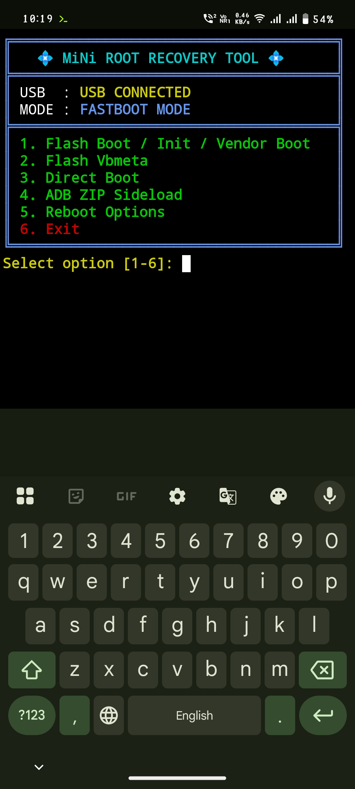

# Mini-TRRT 
Mini Version Of Termux Root Recovery Tool With Batter Usb Connectivity & easy to use only root recovery & sideload Options with automatic AB partition selection.


# install Termux App in phone & update PKG:- 

```Install``` [termux](https://f-droid.org/repo/com.termux_1022.apk) ```&``` [Termux-api](https://f-droid.org/repo/com.termux.api_1001.apk) ```apk Android 13 and lower Device```

```install``` [Termux-monet](https://github.com/Termux-Monet/termux-monet/releases/download/v0.119.0-b1-36/termux-app_v0.119.0-b1-36+apt-android-7-github-debug_universal.apk) ```&``` [Termux-monet-api](https://github.com/Termux-Monet/termux-api/releases/download/v0.50.1-5/termux-api_v0.50.1-5+github-debug.apk) ```apk Android 14 and Newer Device```


```console
yes | pkg update && upgrade
```
```console
yes | pkg install git
```

# clone tool to termux :-

```console
git clone https://github.com/Ishu43642/Mini-TRRT.git
```

```console
cd Mini-TRRT
```
```console
chmod -R +x .
```

# Run Tool 

```console
./start.sh
```


# Tool Feature 
1. 💿 one click boot.img magisk_patch_boot install 

2. ⬇️ Sideload root/recovery/rom

3. 🔗 Flash VBmeta Disable avb warning 

4. Automatic A/B partition detection 
